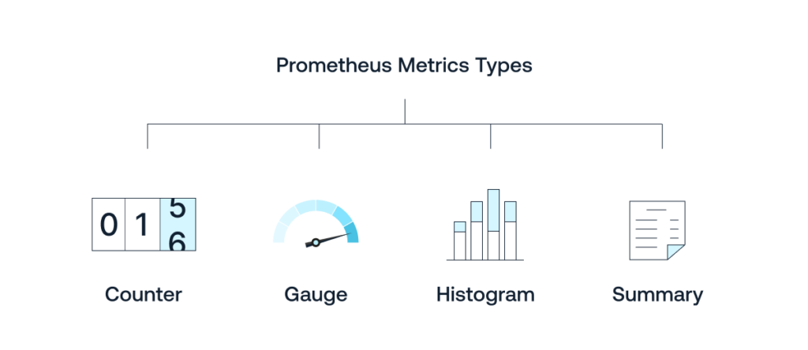

# Part 2: PromQL, Grafana
## PromQL
PromQL uses three data types: scalars, range vectors, and instant vectors.
It also uses strings, but only as literals.

### Metric types

#### Counter
A counter is a cumulative metric that represents a single monotonically increasing counter whose value can only increase or be reset to zero on restart. For example, you can use a counter to represent the number of requests served, tasks completed, or errors.
```
sum(rate(demo_clicks_counter[5m]))
sum(rate(demo_clicks_counter[5m] offset 4m))
```
#### Gauges (измеритель)
A gauge is a metric that represents a single numerical value that can arbitrarily go up and down. For example, you can use a gauge to represent the current CPU usage, memory usage, or the number of concurrent requests.
```
avg_over_time(demo_request_duration_gauge[1m])
```

#### Histograms
A histogram samples observations (usually things like request durations or response sizes) and counts them in configurable buckets. It also provides a sum of all observed values.
_bucket, _sum, _count

```text
demo_click_duration_seconds_sum 5.099400019011227
demo_click_duration_seconds_bucket{le="0.005"} 0.0
demo_click_duration_seconds_bucket{le="0.01"} 0.0
demo_click_duration_seconds_bucket{le="0.025"} 0.0
demo_click_duration_seconds_bucket{le="0.05"} 0.0
demo_click_duration_seconds_bucket{le="0.075"} 0.0
demo_click_duration_seconds_bucket{le="0.1"} 0.0
demo_click_duration_seconds_bucket{le="0.25"} 0.0
demo_click_duration_seconds_bucket{le="0.5"} 2.0
demo_click_duration_seconds_bucket{le="0.75"} 2.0
demo_click_duration_seconds_bucket{le="1.0"} 2.0
demo_click_duration_seconds_bucket{le="2.5"} 5.0
demo_click_duration_seconds_bucket{le="5.0"} 5.0
demo_click_duration_seconds_bucket{le="7.5"} 5.0
demo_click_duration_seconds_bucket{le="10.0"} 5.0
demo_click_duration_seconds_bucket{le="+Inf"} 5.0
demo_click_duration_seconds_count 5.0
```

One of the most common query is to calculate the 95th percentile of a histogram. This is done using the histogram_quantile function. For example, to calculate the 95th percentile of a histogram named demo_click_duration_seconds_bucket, you would use the following query:
```
histogram_quantile(0.95, rate(demo_click_duration_seconds_bucket[2m]))
```
For example, if you have a data set of 100 sorted values, the 95th percentile would be the value at the 95th position in the dataset since 95% of 100 is 95. If you had 200 values, you'd look for the value at position 190 since 95% of 200 is 190.
In practical terms, the 95th percentile is often used in various fields such as finance, health, and network performance to represent a 'worst-case' scenario that isn't as extreme as the absolute maximum. For instance, in network performance, the 95th percentile latency might be used to understand the upper limits of normal latency, disregarding the top 5% of data points which might consist of outliers or anomalies. This helps in planning and ensures that the network performs satisfactorily for the majority of the time.

```
demo_click_duration_seconds_count - ignoring(le) demo_click_duration_seconds_bucket{le="1.0"}
```

#### Summary
A summary is similar to a histogram, but it calculates the quantiles on the client side and exposes them directly as a metric. It also provides a total count of observations and a sum of all observed values.
demo_seconds_summary{quantile="0.5"} 0.5
demo_seconds_summary{quantile="0.9"} 1.8
demo_seconds_summary{quantile="0.99"} 2.0
demo_seconds_summary_sum 4.5
demo_seconds_summary_count 5

A Prometheus summary metric samples observations, like latencies, and provides quantiles,
the total count, and the sum of observed values. 
Unlike histograms, summaries calculate quantiles on the application level, 
making them less suitable for aggregation across multiple instances. 
They're used when precise bucket configurations are unknown beforehand, 
but histograms are generally preferred due to their aggregation capabilities

## Grafana config
Enable a sidecar in the KPS chart config to add dashboards to Grafana:
```yaml
grafana:
  sidecar:
    dashboards:
      enabled: true
      label: grafana_dashboard
```
`helm upgrade prometheus-operator prometheus-community/kube-prometheus-stack -f helm-values/kps-values.yml \
-n monitoring --version 55.0.0`

### Access Grafana
`kubectl port-forward -n monitoring svc/prometheus-operator-grafana 3000:80`

### How to find Grafana default password
```commandline
kubectl get secrets -A | grep grafana
kubectl get secret --namespace monitoring prometheus-operator-grafana -o jsonpath="{.data.admin-user}" | base64 --decode
kubectl get secret --namespace monitoring prometheus-operator-grafana -o jsonpath="{.data.admin-password}" | base64 --decode
```

### create a custom dashboard
add a dashboard via UI
parameterize, variable

#### Visualize a histogram
```commandline
sum(demo_click_duration_seconds_bucket{le!="+Inf"}) by (le)
```
Replace `Time Series` with `Bar Gauge`
Legend: `<={{le}}`

